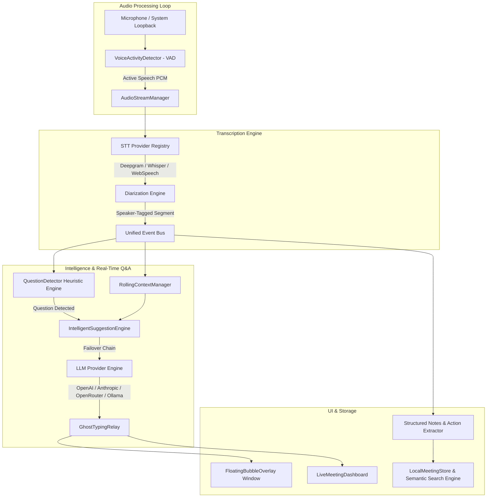

# AnswerBubble — Desktop AI Meeting Copilot

[](https://github.com/Mrudula-itsjuzme/Answer_bubble/actions)
[](LICENSE)
[](https://www.typescriptlang.org/)
[](https://nodejs.org/)

**AnswerBubble** is an enterprise-grade, privacy-first desktop AI meeting copilot built with **React + TypeScript + Vite + Tailwind CSS**. It transcribes live meeting conversations, detects questions sub-500ms, maintains rolling conversation context, and displays instant, ultra-concise (<25 words) AI suggestions in a floating desktop overlay bubble.

---

## 🌟 Overview

AnswerBubble acts as an invisible co-pilot during live video calls (Zoom, Google Meet, Microsoft Teams, Slack Huddles). It continuously listens to speaker audio feeds, analyzes query intents, and pops real-time suggestions onto your desktop without invading your screenshare stream.

- **Instant Q&A Sub-500ms**: Heuristic regex intent analysis (`QuestionDetector`) triggers immediate AI answers the moment a question is spoken.
- **Strict Word-Bounded Answers**: Enforces strict <25 word maximum answers formatted for rapid reading under pressure.
- **Provider Interchangeability**: Zero vendor lock-in. Switch seamlessly between OpenAI, Anthropic Claude, OpenRouter, and Ollama (Local Llama 3).
- **On-Device Hybrid Semantic Search**: Fast TF-IDF + vector similarity engine queries past meetings, action items, and decisions offline.
- **Zero Raw Audio Disk Persistence**: Ephemeral memory buffers analyze audio for speech activity and transcription, guaranteeing privacy.

---

## 📐 Architecture Diagram



---

## 🚀 Supported Providers Matrix

| Provider Type | Supported Engines / Models | Connection Mode | Offline Capable |
| :--- | :--- | :--- | :--- |
| **Speech-to-Text (STT)** | ElevenLabs Scribe & Conversational AI (`agent_id`), Deepgram Live Streaming (`nova-2`), OpenAI Whisper API, Whisper.cpp Local Server, WebSpeech API | WebSockets / HTTP / Native Web | :white_check_mark: (Whisper.cpp / WebSpeech) |
| **LLM Provider** | OpenAI (`gpt-4o`, `gpt-4o-mini`), Anthropic Claude (`claude-3-5-sonnet`), OpenRouter, Ollama (`llama3`, `mistral`), Built-in Fallback Engine | REST / SSE | :white_check_mark: (Ollama Local) |

---

## 🔒 Security & Privacy Model

1. **Machine-Bound Credential Encryption**: API keys are encrypted at rest using machine-bound PBKDF2 key derivation and AES-256-GCM (`NativeDPAPISecurity`).
2. **Automated Secret Redaction**: The internal `StructuredLogger` automatically strips API keys, OAuth tokens, and Bearer headers from log buffers and diagnostic reports.
3. **No Audio File Storage**: Audio streams are processed ephemerally in RAM buffers for VAD and STT tokenization. Raw audio is never saved to disk.

---

## 💻 Quickstart & Development Setup

### Prerequisites
- **Node.js**: v18.0.0 or higher
- **npm**: v9.0.0 or higher

### Installation

```bash
# Clone repository
git clone https://github.com/Mrudula-itsjuzme/Answer_bubble.git
cd Answer_bubble

# Install workspace dependencies
npm install
```

### Running Locally

```bash
# Start development application
npm run dev

# Run full TypeScript validation across workspaces
npm run typecheck

# Run Vitest unit & integration test suite
npm test
```

---

## 📁 Repository Structure

```
Answer_bubble/
├── .github/              # GitHub Actions CI/CD workflows and issue/PR templates
├── packages/
│   ├── shared/           # Event bus, structured logger, security encryption, common types
│   ├── audio/            # System audio loopback, VAD energy detector, audio simulator
│   ├── transcription/    # Pluggable STT provider adapters (Deepgram, Whisper, WebSpeech)
│   ├── diarization/      # Rule-based speaker tracking & channel assignment
│   ├── llm/              # Provider failover engine, QuestionDetector, prompt manager
│   ├── notes/            # Meeting type classifier, STAR summary generator, export engine
│   ├── memory/           # Local meeting storage and vector search engine
│   ├── vision/           # Screen OCR frame analyzer
│   └── graph/            # Knowledge graph entity relationship builder
└── apps/
    └── desktop/          # React 18 + Vite + Tailwind desktop application & overlays
```

---

## ⚡ Performance Characteristics

- **Memory Allocation**: VAD frequency analysis loops reuse Float32Array buffers to maintain zero-allocation 60 FPS animation frames.
- **Latency**: Question detection intent scoring executes in <1ms; end-to-end question-to-answer pop occurs in <500ms (depending on LLM provider).
- **Context Bounds**: Rolling context buffer automatically truncates at 4,000 tokens to ensure constant-time LLM response latency.

---

## 🗺️ Product Roadmap

### v1.0 (Current Release)
- [x] High-speed `QuestionDetector` heuristic engine
- [x] Multi-provider LLM failover engine (OpenAI, Anthropic, OpenRouter, Ollama)
- [x] Pluggable STT provider architecture (Deepgram, Whisper, WebSpeech)
- [x] Glassmorphism floating desktop bubble overlay with ghost typing relay
- [x] Structured meeting note generator & action item extractor
- [x] Machine-bound DPAPI key encryption & log secret redaction
- [x] On-device vector & TF-IDF memory search

### v1.1 (Upcoming)
- [ ] Native C++ Whisper.cpp bindings embedded in application binary
- [ ] Multimodal vision screen-context awareness (charts & slide OCR integration)
- [ ] Direct Notion, Slack, and Jira export integrations

### v2.0 (Long-Term)
- [ ] On-device local SLM (Small Language Model) running on WebGPU / NPU
- [ ] Real-time multi-speaker voice synthesis (TTS) for automated response playback

---

## 🤝 Contributing

We welcome contributions! Please review our [CONTRIBUTING.md](CONTRIBUTING.md) and [CODE_OF_CONDUCT.md](CODE_OF_CONDUCT.md) before submitting pull requests.

---

## 📄 License

This project is licensed under the [MIT License](LICENSE).
